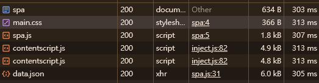
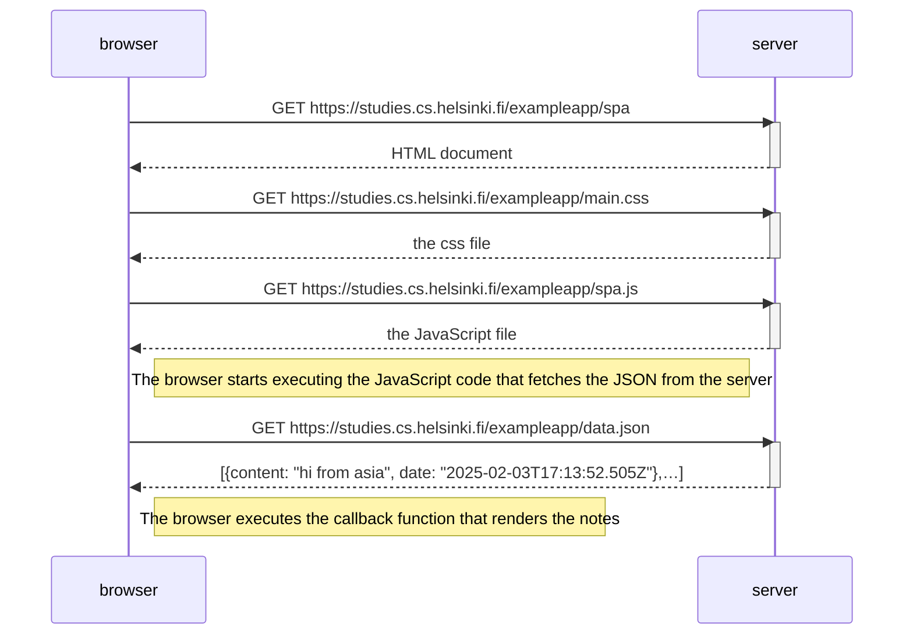

# Console Analysis 

This procedure is what we first encounter in the SPA version of the notes app. It is no different from the non-SPA version of the app(although some filenames have changed, the data flow remains the same).

# Diagram
