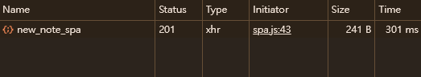
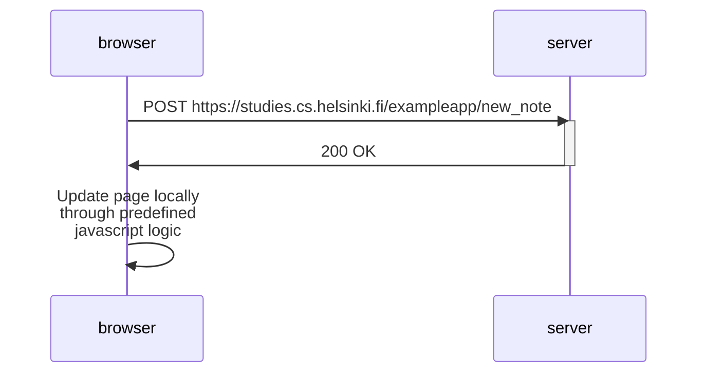

# Console Analysis 

This is what I see when I press the "add note" button of the SPA version of the note app. In the non-SPA version, the browser notifies the server by sending a POST request via form action, and the page refreshes, causing multiple GET requests to fire again. In the SPA version, the POST request to the server is made via javascript. Also the process of keeping the page up-to-date happens through predefined javascript logic, instead of refreshing the page as a whole. Thus, no additional GET requests are needed in the SPA version, aside from the initial POST request to notify the server of updates.

# Diagram
